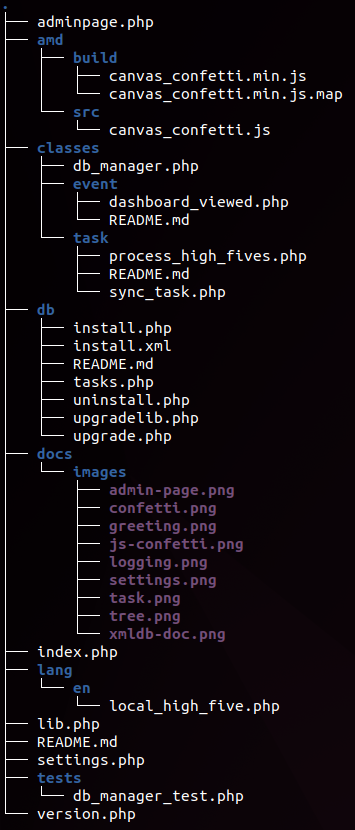
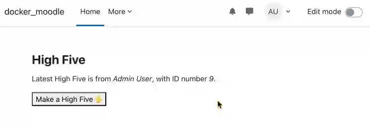
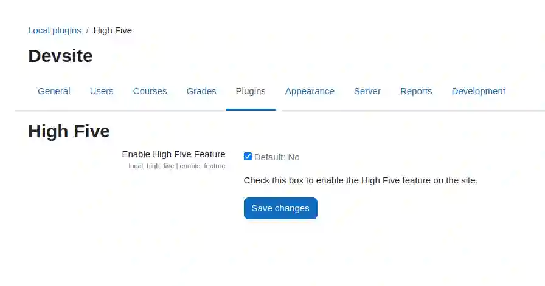

# Moodle Plugin Template

Use this template as a starting point to develop Moodle plugins.

**STATUS:** This is a work-in-progress, supporting discussions on best practices.



## Key features

This template provides a structured, best-practice foundation for developing Moodle plugins, including:

- 📝 [Installation instructions](#quick-start-playground) for developers and users of your module
- :runner: [Some basic, dumb functionality](#functional-examples) for a module that you can edit or remove
- 🔧 [Build system and CI/CD setup](#high-five-plugin) using GitHub Actions
- 🌍 [Localization](./lang) for all strings
- ✅ [Automated](./.github/workflows) code style checks, unit testing

### Functional examples

This repository offers a functional example of a Moodle plugin, with end-user features:

- **An admin accessible page** that is permission-locked to site admins
- **Dashboard page block** for any user to interact with the plugin [ COMING SOON ]
- **Course page block** for any student to interact with the plugin [ COMING SOON ]

And then additionally are some features that a good plugin may have, which are not directly called out in the end-user documentation:

- **[Scheduled task](task/README.md)** to remove old records from the database
- **Settings page** to configure the plugin using the standard Moodle admin settings interface
- **Custom JavaScript** to enhance the user experience
- **Unit test** to ensure the plugin works as expected in the Catalyst CI system
- **[Event logging](classes/event/README.md)** demonstrates how to log events in Moodle using the Events API

You can use these features as they are, modify them, or remove what you don’t need.

## Best practices and resources

Below in the documentation for your new module, and also in [the database README](db/README.md), we cite specific other modules that we recognize as best practice. Such as using "production mode", which is not compliant with DRY.

Additionally, where we think Moodle has not followed best practices, we link to an issue upstream, and provivde a workaround. Such as all the extra boilerplate code necessary to start developing modules.

## How to make your own plugin

1. **[Use this template/fork](https://github.com/new?template_name=moodle-local_plugin_template&template_owner=fulldecent)** and rename it according to Moodle conventions:
   - Format: `moodle-<type>_<pluginname>` (e.g., `moodle-local_example`)
   - `<type>` should match Moodle’s [plugin types](https://moodledev.io/docs/apis/plugintypes).

2. **Customize the README**: Update all content below this section to describe your plugin.

3. **Publish and release**: Remove this line and everything above, then publish your repository as version 1.0.0!

---

---

---

# High Five plugin

Enable students to "high five" each other! Enhance engagement and community.

Supported Moodle versions: 

## Features

### :hand: ​Admin can make a high five

This page is only accessible to administrators.



*If you are running Moodle locally, see this live at [local/high_five/](http://localhost:8000/local/high_five/).*

### Users can make a high five from the dashboard [COMING SOON]

Access on your dashboard page at `Edit mode > Add block > High Five`.

[ IMAGE COMING SOON ]

*If you are running Moodle locally, see this live at [blocks/high_five/](http://localhost:8000/my/index.php).*

### Students can make a high five from inside a course [ COMING SOON ]

Access on your course page at `[ INSTRUCTIONS COMING SOON ]`.

[ IMAGE COMING SOON ]

*If you are running Moodle locally, see this live at [ LINK COMING SOON ].*

### :gear: Site administration page

Turn high fives on or off at `Site administration > Plugins > Local plugins > High Five`.

[ COMING SOON: This will actually disable high fives when off ]



*If you are running Moodle locally, see this live at [admin/settings.php?section=local_high_five](http://localhost:8000/admin/settings.php?section=local_high_five).*

## Quick start playground

:runner: Run a Moodle playground site with *High Five* on your own computer in under 5 minutes! Zero programming or Moodle experience required.

These instructions include code snippets that you will need to copy/paste into your command terminal. On macOS that would be Terminal.app, which is a software you already have installed.

1. Install a Docker system:

   1. On macOS we currently recommend [OrbStack](https://orbstack.dev/). This is the only software which can install Moodle in under 5 minutes. We would prefer if an open source product can provide this experince, but none such exists. See [references](#references) below if you may prefer another option.
   2. On Windows (TODO: add open source recommendation)
   3. On Linux (TODO: add open source recommendation)

2. Create a Moodle testing folder. You will use this to test this plugin, but you could also mix in other plugins onto the same system if you like.

   ```sh
   cd ~/Developer
   mkdir moodle-playground && cd moodle-playground
   ```

3. Install the latest version of Moodle:

   ```sh
   # Visit https://moodledev.io/general/releases to find the latest release, like X.Y.
   
   export BRANCH=MOODLE_X0Y_STABLE # update X and Y here to match the latest release version
   git clone --depth=1 --branch $BRANCH git://git.moodle.org/moodle.git
   ```

   *:information_source: If you see the error "fatal: Remote branch MOODLE_X0Y_STABLE not found in upstream origin", please reread instruction in the code comment and try again.*

   *These instructions include a workaround for [Moodle issue MDL-83812](https://tracker.moodle.org/browse/MDL-83812).*

4. Install the High Five plugin into your Moodle playground:

   ```sh
   git clone https://github.com/fulldecent/moodle-local_plugin_template.git moodle/local/high_five
   ```

5. Get and run Moodle Docker container (instructions adapted from [moodle-docker instructions](https://github.com/moodlehq/moodle-docker)):

   ```sh
   git clone https://github.com/moodlehq/moodle-docker.git
   cd moodle-docker # You are now at ~/Developer/moodle-playground/moodle-docker
   
   export MOODLE_DOCKER_WWWROOT=../moodle
   export MOODLE_DOCKER_DB=pgsql
   bin/moodle-docker-compose up -d
   bin/moodle-docker-wait-for-db
   
   cp config.docker-template.php $MOODLE_DOCKER_WWWROOT/config.php
   bin/moodle-docker-compose exec webserver php admin/cli/install_database.php --agree-license --fullname="Docker moodle" --shortname="docker_moodle" --summary="Docker moodle site" --adminpass="test" --adminemail="admin@example.com" --adminuser='admin'
   ```

   *:information_source: If you see the error "Database tables already present; CLI installation cannot continue", please follow the "teardown" instructions below and then try again.*

   *:information_source: If you see the error "!!! Site is being upgraded, please retry later. !!!", and "Error code: upgraderunning…", please ignore the error and proceed.*

   *These instructions include a workaround for [moodle-docker issue #307](https://github.com/moodlehq/moodle-docker/issues/307).*

6. :sun_with_face: Now play with your server at <http://localhost:8000>

   1. Click the top-right to login.
   2. Your username is `admin` and your password is `test`.

   *:information_source: If you see a bunch of stuff and "Update Moodle database now", then click that button and wait. On a M1 Mac with 8GB ram, we saw this take 5 minutes for the page to finish loading.*

7. To completely kill your playground so that next time you will start with a blank slate:

   ```sh
   bin/moodle-docker-compose down --volumes --remove-orphans
   colima stop
   ```

If you have any further questions about the playground setup, customizing it or other error messages, please see [moodle-docker documentation](https://github.com/moodlehq/moodle-docker) and [contact that team](https://github.com/moodlehq/moodle-docker/issues).

## Install

Install High Five on your quality assurance or production server the same way as on the playground:

1. ```sh
   git clone https://github.com/fulldecent/moodle-local_plugin_template.git local/high_five
   ```

2. Load your website in the browser to set up plugins.

## Updating JavaScript

*You only need these instructions if you contribute changes to this High Five plugin, specifically the functionality in JavaScript.*

This project uses asynchronous module definition (AMD) to compile JavaScript. This improves performance of modules and is a best practice for Moodle modules [CITATION NEEDED].

1. Install Node (we recommend using [nvm](https://github.com/nvm-sh/nvm))

   1. See the required version in your package.json file:

      ```sh
      cd ~/Developer/moodle-playground/moodle/local/high_five
      cat ../../package.json | grep '"node"'
      ```

2. Install a Node package manager (we recommend [Yarn Berry](https://github.com/yarnpkg/berry)).

   ```shcorepack enable
   corepack enable
   ```

3. Install packages

   ```sh
   yarn install
   ```

4. Run the Grunt script to rebuild the AMD module

   ```sh
   yarn exec grunt amd
   ```

The end result is that your files in [amd/build](amd/build) will be updated, assuming you have made changes to your files in [amd/source](amd/source).

Do commit these built artifacts in your repository (do not gitignore the amd/build directory). Yes, this is a violation of DRY principle. This is called "production mode" and it is a documented best practice for Moodle modules [CITATION NEEDED].

## Setting up the high five block plugin

To use the High Five plugin as a block in Moodle, follow these steps:

1.  **Create the block folder structure:**

    -   Inside your local `high_five` plugin directory, create a folder named `block`.
    -   Inside the `block` folder, create the following subfolders and files:
        -   `db/` (for database-related files)
        -   `lang/` (for language files)
        -   `version.php` (to define the plugin version)
        -   `block_high_five.php` (the main block file)
2.  **Create a symbolic link:**

    -   Navigate to your Moodle installation's `blocks` directory.
    -   Create a symbolic link to the `block` folder inside your `high_five` plugin directory. This allows Moodle to recognize the plugin as a block.
    -   On Unix-based systems (Linux/macOS), use the following command:

        `ln -s /path/to/your/high_five/block /path/to/moodle/blocks/high_five`

3.  **Verify the setup:**

    -   After creating the symbolic link, navigate to your Moodle site as an administrator.
    -   Go to `Site administration > Notifications`. Moodle should detect the new block and prompt you to install it.
    -   Follow the on-screen instructions to complete the installation.
4.  **Using the block:**

    -   Once installed, you can add the "High Five" block to any course or dashboard page.
    -   To add the block:
        1.  Turn on editing mode.
        2.  Click "Add a block" in the blocks drawer.
        3.  Select "High Five" from the list of available blocks.
5.  **Development and customization:**

    -   You can now develop and customize the block by editing the files in the `block` folder of your `high_five` plugin.

6. **Troubleshooting:**
   - If the block does not appear in Moodle, ensure the symbolic link is correctly set up and that the `block` folder contains the necessary files (`version.php`, `block_high_five.php`, etc.).
   - Check the Moodle logs for any errors related to the block installation.

By following these steps, you can successfully integrate the High Five plugin as a block in your Moodle installation.

## Contributing

Please send PRs to our [main branch](https://github.com/fulldecent/moodle-local_plugin_template).

## References

1. This module is built based on [best practices documented in moodle-local_plugin_template](https://github.com/fulldecent/moodle-local_plugin_template).
2. Setting up Docker
   1. We would prefer an open-source-licensed Docker implementation that runs at native speed on Mac, Linux and Windows. For Mac, you may prefer to [install Colima](https://github.com/abiosoft/colima?tab=readme-ov-file#installation) which is open source but about 5x slower than the OrbStack recommended above.
3. Setting up playground
   1. If you require a few courses and users to test your plugin, you may want to look at the [generator tool](https://moodledev.io/general/development/tools/generator).
4. Continuous integration
   1. This plugin uses [the Moodle CI suite recommended by Catalyst](https://github.com/catalyst/catalyst-moodle-workflows)
   2. Perhaps we would prefer the CI suite provided by Moodle, but their approach [does not allow you to set it once and forget it](https://github.com/moodlehq/moodle-plugin-ci/issues/323).
   3. If you face issues with CI during the build, refer to the [Catalyst README](https://github.com/catalyst/catalyst-moodle-workflows/tree/bbb7b5fba5f8304b8b07ad5534b666202d1751c8?tab=readme-ov-file#amd--grunt-bundling-issues) for troubleshooting tips.
5. JavaScript modules in Moodle. For best practices on how to use JavaScript modules in Moodle,
  including the use of AMD for asynchronous loading, check the [Moodle JavaScript Modules Documentation](https://moodledev.io/docs/4.5/guides/javascript/modules). We recommend including the amd/build folder in your repo with your build files. This is not DRY, it is "production mode". Examples of other Moodle modules recommending this best practice are [h5p plugin](https://github.com/h5p/moodle-mod_hvp), [attendance plugin](https://github.com/danmarsden/moodle-mod_attendance/tree/MOODLE_404_STABLE/amd).
