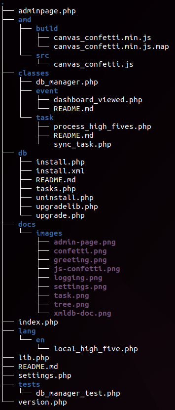
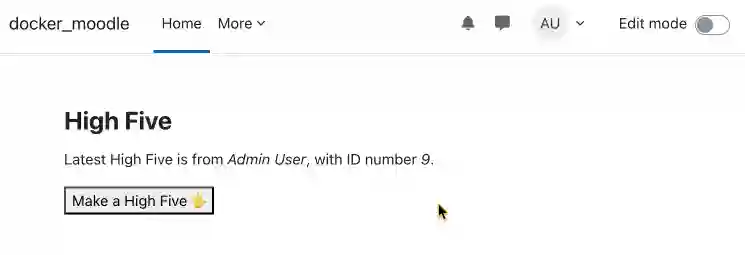
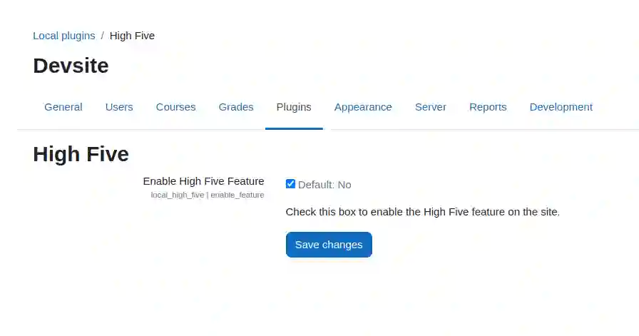
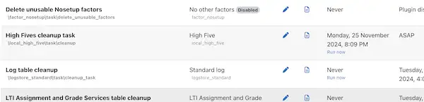
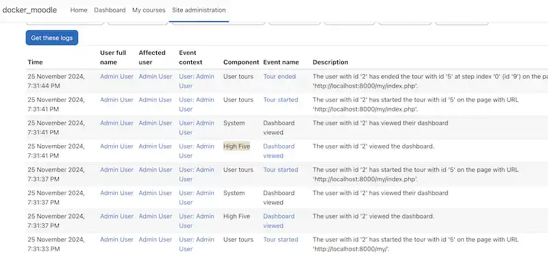

# High Five

> [!TIP]
> This template is a starting point you can use for a Moodle plugin. We offer:
>
> * A working local plugin, with a database, an admin page, a setting, a scheduled task, an event, and an AMD module
> * A block plugin in the same repository, and the symlink Moodle needs before it will load that block
> * Playground instructions that use [moodle-docker](https://github.com/moodlehq/moodle-docker)
> * Continuous integration with [Catalyst's Moodle workflows](.github/workflows/ci.yml), and a [monthly run](.github/workflows/moodle-compatibility.yml) against the newest Moodle stable branch
> * Continuous integration to [check formatting](.github/workflows/lint.yml)
> * Automated releases with [Release Please](.github/workflows/release.yml) and SLSA provenance attestation
> * Modern [EditorConfig](.editorconfig), [.gitignore](.gitignore) and linting
>
> What is in-scope for this template?
>
> We the people who write Moodle plugins, in order to hand a new plugin a working example and a release Moodle can install, maintain this starting point.
>
> The example stays one local plugin plus the block that belongs with it. It shows the files a plugin grows into. It does not generate every plugin type, and it does not publish your plugin to the Moodle Marketplace.
>
> And now below is the template, shown for a specific hypothetical project, enjoy!

[](https://github.com/fulldecent/moodle-local_plugin_template/actions/workflows/lint.yml) [](https://github.com/fulldecent/moodle-local_plugin_template/actions/workflows/build-test.yml) [](https://github.com/fulldecent/moodle-local_plugin_template/actions/workflows/ci.yml) [](https://github.com/fulldecent/moodle-local_plugin_template/actions/workflows/moodle-compatibility.yml)

Students and teachers record a high five. An administrator can record one too.



> [!NOTE]
> Replace the project name, description, pictures and badge URLs with your own.
>
> Rename the component. This example is `local_high_five`, in a repository named `moodle-local_plugin_template`. Name your repository `moodle-<type>_<name>`. Moodle loads the plugin from a directory named `<name>`. The type is one of Moodle's [plugin types](https://moodledev.io/docs/apis/plugintypes).
>
> The block in [block/](block/) is a second component, `block_high_five`. Moodle loads blocks from `blocks/`, so the playground instructions symlink that directory. Delete the block when your plugin is not a block.

## Try it out

Run a Moodle site with High Five on your own computer. These commands are copied into a terminal. On macOS that terminal is Terminal.app, which is already installed.

1. Install Docker.

   On macOS, [OrbStack](https://orbstack.dev/) is the Docker host these instructions were tried with. [Colima](https://github.com/abiosoft/colima?tab=readme-ov-file#installation) is an open-source Docker host and is about 5x slower for this workload.

   On Windows, install [Docker Desktop](https://docs.docker.com/desktop/setup/install/windows-install/). On Linux, install [Docker Engine](https://docs.docker.com/engine/install/) and the Compose plugin.

2. Create a folder for the playground. Other plugins can be copied into the same Moodle tree.

   ```sh
   cd ~/Developer
   mkdir moodle-playground && cd moodle-playground
   ```

3. Install the newest Moodle stable branch.

   The number in `MOODLE_405_STABLE` is the version. A plain `sort` orders `MOODLE_39_STABLE` after `MOODLE_400_STABLE`, so this sorts on that number.

   ```sh
   branch=$(git ls-remote --heads git://git.moodle.org/moodle.git 'refs/heads/MOODLE_*_STABLE' \
     | sed -n 's#.*refs/heads/\(MOODLE_[0-9][0-9]*_STABLE\)#\1#p' \
     | awk -F_ '{print $2, $0}' | sort -n | awk '{print $2}' | tail -n 1)
   git clone --depth=1 --branch "$branch" git://git.moodle.org/moodle.git
   ```

   If Git refuses `git://`, repeat the clone with `https://git.moodle.org/moodle.git` and the same `--branch`. The `git://` URL is the one [moodle-docker](https://github.com/moodlehq/moodle-docker) documents, as a workaround for [MDL-83812](https://moodle.atlassian.net/browse/MDL-83812).

4. Install High Five into that Moodle tree.

   ```sh
   git clone https://github.com/fulldecent/moodle-local_plugin_template.git moodle/local/high_five
   ln -s ../local/high_five/block moodle/blocks/high_five
   ```

   The symlink is how Moodle finds the block. The block's code stays in this repository.

5. Start Moodle in Docker. These commands follow [moodle-docker](https://github.com/moodlehq/moodle-docker).

   ```sh
   git clone https://github.com/moodlehq/moodle-docker.git
   cd moodle-docker

   export MOODLE_DOCKER_WWWROOT=../moodle
   export MOODLE_DOCKER_DB=pgsql
   bin/moodle-docker-compose up -d
   bin/moodle-docker-wait-for-db

   cp config.docker-template.php $MOODLE_DOCKER_WWWROOT/config.php
   bin/moodle-docker-compose exec webserver php admin/cli/install_database.php \
     --agree-license --fullname="Docker moodle" --shortname="docker_moodle" \
     --summary="Docker moodle site" --adminpass="test" --adminemail="admin@example.com" \
     --adminuser='admin'
   ```

   If the installer says `Database tables already present`, run the teardown below and start this step again.

   If the installer says `Site is being upgraded, please retry later` with `upgraderunning`, continue. That message is [moodle-docker issue 307](https://github.com/moodlehq/moodle-docker/issues/307).

6. Open <http://localhost:8000>. Log in as `admin` with password `test`.

   If Moodle asks to update the database, confirm that page and wait for it to finish.

7. Tear the playground down when you want the next run to start empty. Run this from `moodle-docker`.

   ```sh
   bin/moodle-docker-compose down --volumes --remove-orphans
   ```

Questions about the Docker host, the database, or an error from these commands go to [moodle-docker](https://github.com/moodlehq/moodle-docker/issues).

> [!NOTE]
> Point this section at a running demo of your plugin, or keep the playground and replace the clone URL with your repository.

## Installation

Install a published zip, or clone the repository into the Moodle tree.

The zip from the [releases page](https://github.com/fulldecent/moodle-local_plugin_template/releases) unpacks to a single `high_five` directory. In Moodle, go to Site administration > Plugins > Install plugins, and upload that zip. Moodle rejects a zip whose top directory has a different name.

To install from git, from the Moodle root:

```sh
git clone https://github.com/fulldecent/moodle-local_plugin_template.git local/high_five
ln -s ../local/high_five/block blocks/high_five
```

Open the site. Moodle's notifications page installs the plugin and the block.

> [!NOTE]
> After you rename the plugin, the zip's top directory and this path both have to use the new name. Moodle's installer compares that directory name to the component in `version.php`.

## Usage

An administrator records a high five at `local/high_five/`.



On a playground that page is <http://localhost:8000/local/high_five/>.

The setting is at Site administration > Plugins > Local plugins > High Five.



The checkbox is stored as `local_high_five/enable_feature`. The admin page and the block do not read it. It is the example of Moodle's admin settings API.

The block lists the latest high five and can record another. Add it from the blocks drawer on the dashboard or on a course page, after the symlink in [Try it out](#try-it-out) is in place. The block is available on the site home, the dashboard, and course pages.

A scheduled task deletes old rows. The task class and the cron line are documented in [classes/task/README.md](classes/task/README.md).



Opening the dashboard logs an event. The event class is documented in [classes/event/README.md](classes/event/README.md).



The database tables are documented in [db/README.md](db/README.md).

## Development

Thank you for taking an interest in High Five and in the plugins people start from this project.

Moodle's coding style, the PHPUnit run, and the AMD build are what [ci.yml](.github/workflows/ci.yml) runs, on pull requests and on pushes to a protected branch.

### JavaScript

Change AMD source under [amd/src](amd/src), then rebuild from a Moodle checkout that has this plugin installed. The Node.js version is the one in Moodle's own `package.json`, not a version file in this repository.

```sh
cd ~/Developer/moodle-playground/moodle
grep '"node"' package.json
corepack enable
yarn install
yarn exec grunt amd --root=local/high_five
```

Commit the files Grunt writes under [amd/build](amd/build). Moodle serves those files in production and does not compile AMD on the server. That is the layout the [h5p activity](https://github.com/h5p/moodle-mod_hvp) and the [attendance activity](https://github.com/danmarsden/moodle-mod_attendance/tree/MOODLE_404_STABLE/amd) ship, and it is what [Moodle's JavaScript modules guide](https://moodledev.io/docs/4.5/guides/javascript/modules) describes.

Prettier does not format `amd/`. Its output and Moodle's Grunt output disagree, and CI then reports a stale AMD build.

### Block

Moodle will not load `block/block_high_five.php` from inside `local/high_five`. The plugin type `block` is loaded from `blocks/<name>`. The symlink in [Try it out](#try-it-out) is that path. `block/version.php` reads the local plugin's version and then sets the component to `block_high_five`, so the two plugins share one version number.

### Testing

Pull requests run [ci.yml](.github/workflows/ci.yml). You can format the files that workflow does not cover before you push:

```sh
npx prettier@latest --check . --write
npx markdownlint-cli@latest "**/*.md" --fix
```

PHP syntax is checked by [build-test.yml](.github/workflows/build-test.yml), which also builds `high_five.zip`.

### Releases

This repository has two version numbers, and they are not the same number.

The template release is SemVer. Use `fix:`, `feat:` or `BREAKING CHANGE:` in your commit messages. Release Please opens a release pull request from those messages. Merging that pull request tags `v1.2.3` and the [release workflow](.github/workflows/release.yml) publishes `high_five.zip` with a SLSA provenance attestation and a version attestation.

The plugin version is `$plugin->version` in [version.php](version.php), a `YYYYMMDDXX` integer. Moodle refuses to upgrade a plugin when this number does not increase. Release Please does not write this file. Bump it in the commit that changes plugin behavior. Catalyst's workflow can publish to the Moodle plugins directory when `version.php` changes and `MOODLE_ORG_TOKEN` is set. The secret in [ci.yml](.github/workflows/ci.yml) stays commented until you publish under your own component name.

> [!NOTE]
> In your GitHub repository settings, under Actions, General, Workflow permissions, select read and write permissions and check "Allow GitHub Actions to create and approve pull requests". Under General, Releases, enable release immutability. Release Please needs the permission. The publish job needs immutability so a release cannot be replaced after it is attested.
>
> A repository created from this template starts with no tags. Release Please reads the latest tag on the default branch. The publish job accepts a tag shaped like `v1.2.3`.
>
> The zip is packed as `high_five/`. After you rename the plugin, change that directory name in [build-test.yml](.github/workflows/build-test.yml). Moodle's installer rejects a zip whose top directory does not match the component.

### Maintenance

The project administrator completes these maintenance tasks each month. If they are 3+ months late, please remind them or send your own issue or pull request.

1. Read [External actions](https://docs.github.com/en/actions/reference/security/secure-use#using-third-party-actions) versions in [.github/workflows](.github/workflows) and update the ones you have reviewed. Actions under the `actions/` organization need a shorter review.
2. Read the [Moodle compatibility](.github/workflows/moodle-compatibility.yml) run. It installs the plugin on the newest `MOODLE_*_STABLE` branch. When that run is green and [version.php](version.php) still names an older branch in `$plugin->supported`, widen that range.
3. Catalyst's Moodle workflow is taken from `@main` on purpose, so its Moodle branch cache keeps moving. Read their changelog when the [Moodle CI](.github/workflows/ci.yml) run starts failing without a change in this repository.

## Project scope

Moodle plugin authors need a first commit that already has a database, a page, a test, and a release an administrator can upload. High Five is that first commit, for a local plugin.

This project will keep the example small enough to read in one sitting. A second plugin type is here only because a block cannot live inside a local plugin's directory, and showing the symlink is the point of including it.

We will not add a generator that asks for a plugin type and rewrites the tree. We will not publish `local_high_five` to the Moodle Marketplace. That component name belongs to this example.

> [!NOTE]
> Say who your plugin is for, what you will take, and what you will not take.

## References

1. We use title case only for proper nouns, including the name of our project.
1. This project is built based on [best practices documented in moodle-local_plugin_template](https://github.com/fulldecent/moodle-local_plugin_template), release 1.0.0.
1. This project is built based on [best practices documented in project-template](https://github.com/fulldecent/project-template), release 1.3.0.
1. [EditorConfig](.editorconfig) and the top of [.gitignore](.gitignore) are taken from project-template release 1.3.0. `/dist/` is the local copy of the release zip.
1. The interface files of a Moodle plugin are [GPL-3.0-or-later](https://moodledev.io/general/community/plugincontribution/checklist). [LICENSE](LICENSE) is that text. Several docblocks had named the MIT license while the file header named the GPL. The docblocks now name the GPL.
1. Moodle CI on pull requests is [Catalyst's reusable workflow](https://github.com/catalyst/catalyst-moodle-workflows). Its `pre_job` skips `schedule`. [moodlehq/moodle-plugin-ci](https://github.com/moodlehq/moodle-plugin-ci/issues/323) makes you name each Moodle branch, which is why the monthly workflow discovers the newest stable branch itself. The job's steps follow [`gha.dist.yml`](https://github.com/moodlehq/moodle-plugin-ci/blob/main/gha.dist.yml) in moodle-plugin-ci, including `shivammathur/setup-php@v2`.
1. AMD output is committed. See [Moodle's JavaScript modules guide](https://moodledev.io/docs/4.5/guides/javascript/modules), the [h5p activity](https://github.com/h5p/moodle-mod_hvp), and the [attendance activity](https://github.com/danmarsden/moodle-mod_attendance/tree/MOODLE_404_STABLE/amd).
1. The playground clone uses `git://git.moodle.org/moodle.git`, which is the URL in the [moodle-docker](https://github.com/moodlehq/moodle-docker) instructions and the workaround recorded for [MDL-83812](https://moodle.atlassian.net/browse/MDL-83812). The upgrade-running message is [moodle-docker issue 307](https://github.com/moodlehq/moodle-docker/issues/307).
1. This project is released under the [GNU GPL v3 or later](LICENSE).

> [!NOTE]
> Moodle plugins that implement the core interface are GPL-3.0-or-later. Replace [LICENSE](LICENSE) only when you have a reason Moodle's rule does not apply, and say so here.
>
> Cite the release of moodle-local_plugin_template you copied, and the release of project-template that template cited.
