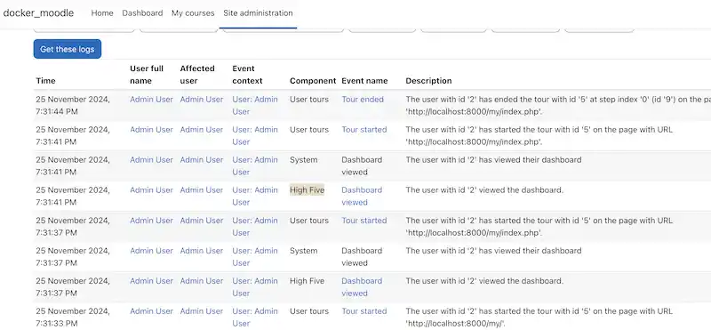

# Dashboard viewed event

## Overview

The `dashboard_viewed` event is a custom logging event triggered whenever a user accesses their dashboard in Moodle. This event has been added as part of the **local_high_five** plugin to demonstrate how to log and track user actions using Moodle's event and logging APIs.

## How it works

1. The event is defined in the file:
    - `classes/event/dashboard_viewed.php`
2. The event is triggered in the `lib.php` file when the dashboard page (`/my`) is accessed:
    - Function: `local_high_five_extend_navigation()`
3. The event is logged into the Moodle logs (`mdl_logstore_standard_log`) and can be viewed in:
    - **Site administration > Reports > Logs**

[!Logging event](/docs/images/logging.png)

## File details

### `dashboard_viewed.php`

- Defines the `dashboard_viewed` event.
- Includes metadata like CRUD type, description, and related URL.

### `lang/en/local_high_five.php`

- Adds the language string for the event name (`Dashboard viewed`).

### `lib.php`

- Contains the logic to trigger the event when the dashboard is accessed.

## References

For more information about Moodle’s event and logging API, refer to the following documentation for Moodle 4.5:

- [Moodle events API documentation](https://docs.moodle.org/dev/Events_API)
- [Moodle logging documentation](https://docs.moodle.org/405/en/Logging)
