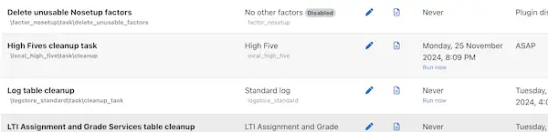

# Scheduled task for background processing

Old high fives are periodically removed from the database with a Moodle task.

## Overview

This plugin includes a scheduled task to process background operations.

## Task class

The task class `\local_high_five\task\cleanup` is defined in [`classes/task/cleanup.php`](./cleanup.php).

### Key features

- **Automated execution:** Runs at specified intervals based on the cron schedule.
- **Custom logic:** Deletes old records from the database using the database mananger.

## Configuration

1. **Task definition:** Ensure the task is defined in `db/tasks.php`.
2. **Version update:** Update the plugin's version in `version.php` to register changes.

## Usage

1. View tasks under `Site administration > Server > Scheduled tasks`.

   

2. Execute manually (CLI):

   ```sh
   php admin/cli/scheduled_task.php --execute="\local_high_five\task\cleanup"
   ```

## References

- [Moodle scheduled tasks documentation](https://docs.moodle.org/405/en/Scheduled_tasks)
- [Moodle task API](https://moodledev.io/docs/4.5/apis/subsystems/task/scheduled)
