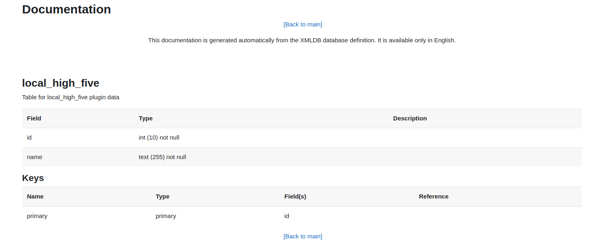

# Database schema

This directory contains schema files for managing the installation, upgrade, and uninstallation of the Moodle plugin's database, along with custom database interactions and data cleanup.

## Files

### `install.xml`

Defines tables, fields, keys, and relationships, and is automatically read during installation to create the database schema.

- Use the [Moodle XMLDB editor](https://moodledev.io/general/development/tools/xmldb) to keep the schema in the form Moodle's database layer accepts.
- You can check the generated schema in the Moodle XMLDB tool at [admin/tool/xmldb](https://your-url/admin/tool/xmldb/).
  - Search for `local/high_five/db` to find the database schema.
  - This documentation is generated from the XMLDB database definition and is available only in English.

### `install.php` (optional)

Handles additional setup tasks during installation, such as initializing default settings, creating extra tables, or pre-loading data. Moodle runs this file when it exists. `install.xml` creates the tables. `install.php` is for setup that a schema file cannot express.

### `upgradelib.php` (optional)

Contains functions for upgrading the database schema. Moodle calls it during upgrades.

### `uninstall.php` (optional)

Handles data cleanup when uninstalling the plugin.

### `db_manager.php`

**Location:** [`classes/db_manager.php`](../classes/db_manager.php)

Encapsulates database interactions and the SQL this plugin runs. The methods follow Moodle's [`moodle_database.php`](https://github.com/moodle/moodle/blob/MOODLE_405_STABLE/lib/dml/moodle_database.php).

### Plugins that use the same database API

- [Configurable reports](https://github.com/jleyva/moodle-block_configurablereports) uses `$DB->get_record` and the other database methods for querying and reporting.
- [Ad-hoc database queries](https://github.com/moodleou/moodle-report_customsql) runs custom queries through `$DB`.
- [Attendance](https://github.com/danmarsden/moodle-mod_attendance) stores session records with Moodle's database methods.

## Best practices

- Keep `install.xml` simple and follow Moodle's XMLDB schema standards.
- Use `upgradelib.php` for version-specific database changes.
- Document schema changes for future reference.

## Resources

- [Data manipulation API](https://moodledev.io/docs/4.5/apis/core/dml)
- [Moodle XMLDB documentation](https://docs.moodle.org/dev/XMLDB)
- [Plugin development guidelines](https://docs.moodle.org/dev/Plugin_contribution)
